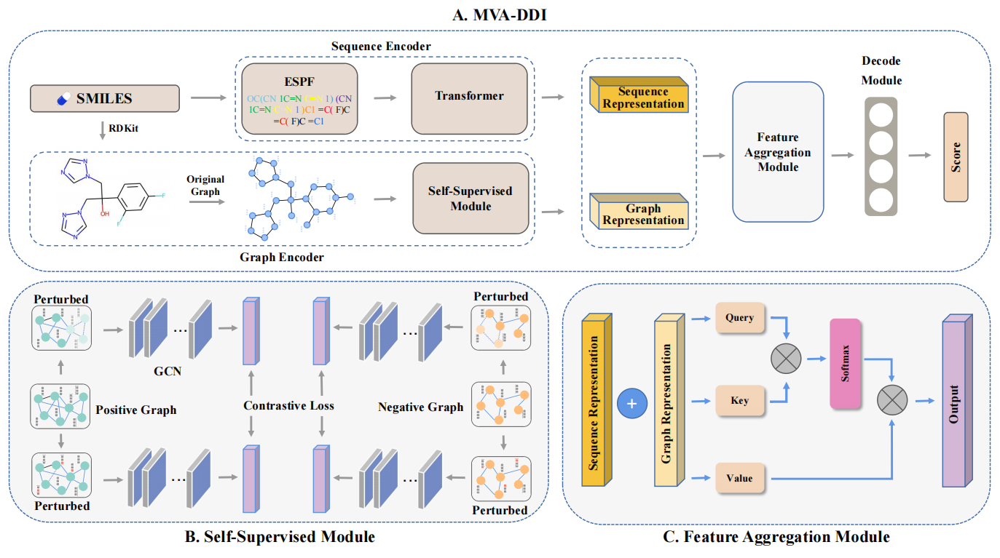

# MVA-DDI

##### MVA-DDI: Interpretable attention network with multi-view learning for drug-drug interaction prediction

##### 

# File description

- ##### Data: Pre-split training set, test set, and validation set.

- ##### Encoder/deal_data.py: SMILES data preprocessing.

- ##### ESPF: Encoding dictionary and corresponding fields.

- ##### Model/MVA.py: Model code.

- ##### log.py: Evaluation metrics calculation.

- ##### losses.py: Implementation of cross-entropy loss function.

- ##### Result_vis.py: Visualization of loss and roc results.

- ##### train.py: Main function for model training and testing.

- ##### violin.py: Drawing violin analysis plot.

# Requirement

- ##### Python == 3.7

- ##### Pytorch

- ##### RDKit

- ##### scikit-learn

- ##### subword_nmt

# Usage

```
python train.py
```

# Dataset

##### Our dataset comes from DrugBank (V5.1.9) and ChEMBL (V32). We provide the preprocessed dataset, but you can also directly download the original DrugBank dataset [V5.1.9](https://go.drugbank.com/releases/5-1-9) and ChEMBL dataset [V32](https://www.ebi.ac.uk/chembl/)
